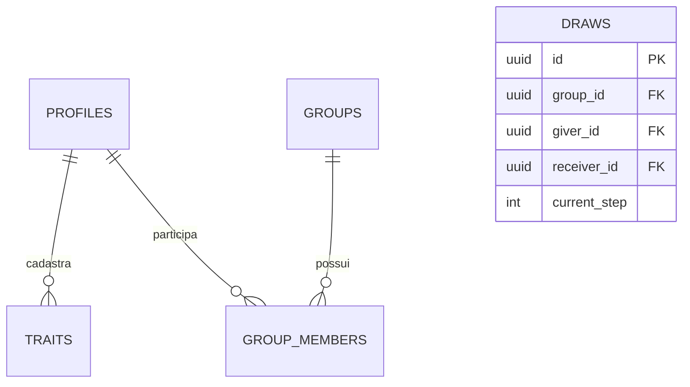
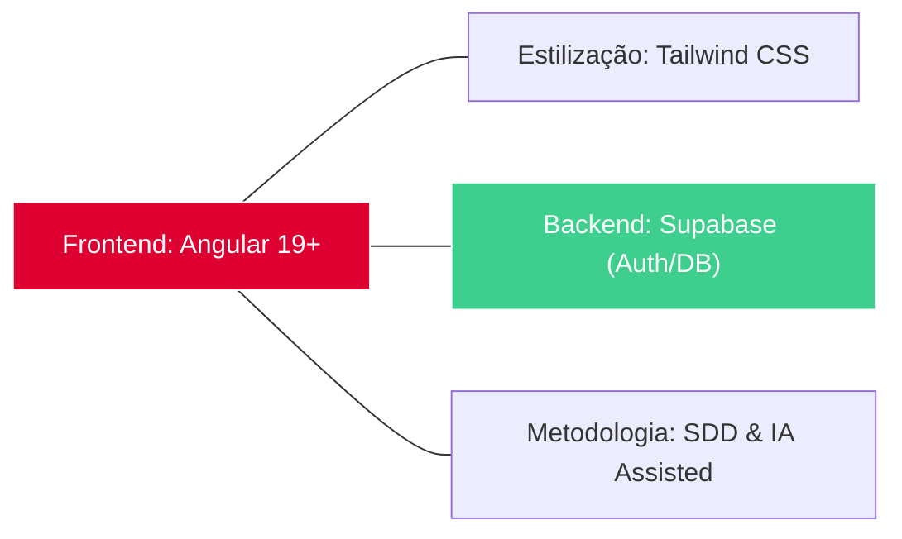

<h1 align="center">🎅 SecretSanta (UTF-Secret)</h1>

  <strong>Sistema Gamificado de Amigo Secreto para o Portal UTFApps</strong>

  
  
  
  

---

## 🔗 Informações Gerais
* **🌐 Link em Produção:** [Aguardando Deploy no GitHub Pages/Vercel]
* **👤 Autores:** Gabriel Campos Manzole e [Adicione os outros nomes aqui]
* **🎓 Instituição:** UTFPR - Campus Guarapuava (TSI)
* **🚀 Status:** Entrega 1 - Concepção e Planejamento

---

## 🎯 1. Visão Geral
O **SecretSanta** é uma aplicação web progressiva (PWA) que reinventa a dinâmica do Amigo Secreto. Em vez de apenas revelar um nome, o sistema introduz o conceito de **"The Quest"**: um jogo de dedução onde o participante deve adivinhar quem tirou através de pistas baseadas em características pessoais.

A aplicação utiliza o ecossistema **Angular 19** para garantir uma experiência reativa e fluida, integrada ao **Supabase** para autenticação e banco de dados em tempo real.

---

## 📚 2. Documentação Oficial (Docs as Code)
Toda a engenharia do sistema está detalhada na pasta `/docs`:
* [📄 **PRD (Product Requirements Document)**](./docs/prd.md)
* [📐 **SDD (Software Design Document)**](./docs/sdd.md)
* [🎨 **Protótipo no Figma**](LINK_DO_SEU_FIGMA_AQUI)

---

## 📊 3. Modelagem de Dados (Diagrama ER)

## 📊 4. Pilha Tecnológica

## 5. Checklist de Funcionalidades (IDs)
[ ] RA1: Protótipo Figma e Configuração PWA (Manifest).

[ ] RA2: Componentes Standalone e Fluxo de Controle @for/@if.

[ ] RA3: Estado Reativo com Signals, computed e model().

[ ] RA4: Comunicação entre componentes via input() e output().

[ ] RA6: Integração completa com Supabase Auth e CRUD.

[ ] RA7/8: Gitflow e Orquestração de IA documentada.

## 🚀 6. Início Rápido (Desenvolvimento Local)
Clonar o repositório:

Bash
git clone https://github.com/GabrielCamposManzole/secret-santa.git
cd secret-santa
Instalar dependências:

Bash
npm install
Executar o projeto:

Bash
ng serve
Acesse http://localhost:4200 no seu navegador.
