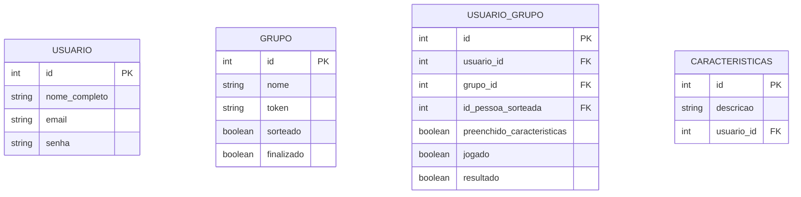

# 🛠️ Software Design Document (SDD) - SecretSanta

**Projeto:** SecretSanta
**Versão:** 1.0.0
**Status:** ⚪ Aguardando Geração de Especificações.
**Stack Principal:** Angular, Prisma ORM, PostgreSQL.

## 🤖 1. Orquestração e Contexto de IA (MCP)

- **Figma MCP:** [link] (Ler design tokens, cores e hierarquia visual).
- **Supabase MCP:** Contexto do banco de dados real e políticas de RLS.
- **GitHub MCP:** Leitura das Issues do Kanban para orientar a implementação (Spec-Driven).

## 📦 2. Stack Tecnológica e Bibliotecas

- **Core:** Angular 21+ (Standalone / Signals).
- **BaaS & Auth:** Supabase-js.
- **Estilização & UI:** Tailwind v4, daisyUI (componentes pré-estilizados), Lucide Angular (Ícones).

## 🗄️ 3. Arquitetura de Dados

### 📖 3.1. Glossário Técnico

| Termo PRD (PT-BR) | Entidade Técnica (EN) | Descrição                                              |
| :---------------- | :-------------------- | :----------------------------------------------------- |
| Usuário           | `USUARIO`             | Dados de conta do participante.                        |
| Grupo             | `GRUPO`               | Nome, token de convite e estado global do jogo.        |
| Participação      | `USUARIO_GRUPO`       | Quem está no grupo, quem sorteou e se já jogou.        |
| Características   | `CARACTERISTICAS`     | Dicas cadastradas pelo usuário para serem descobertas. |

### 📊 3.2. Diagrama ER (Mermaid)

## 📑 4. Contratos Globais (Interfaces & Types)

> Tipagem TypeScript baseada no banco de dados.

> [Interfaces TypeScript globais serão inseridas aqui]

## 🏗️ 5. Scaffolding Macro (Arquitetura Frontend)

### 📂 5.1. Estrutura de Pastas Global (Workspace)

O projeto utiliza uma estrutura de Monorepo para separar a documentação, o backend e o frontend.

- **`docs/`**: Documentação oficial do projeto (PRD, SDD, manuais).
- **`apps/api/`**: Reservado para o Backend/Servidor (Node/Supabase Edge Functions).
- **`apps/web/`**: Aplicação Frontend principal (Angular + Tailwind).

### 🧩 5.2. Arquitetura Frontend (`apps/web/src/app/`)

Adotamos a arquitetura **Feature-Driven**, onde o código é organizado por domínios de negócio, promovendo o desacoplamento e a escalabilidade.

- **`core/`**: A "fundação" do app. Contém elementos que rodam apenas uma vez (Singletons), como Guards, Interceptors e Services globais (ex: `AuthService`).
- **`shared/`**: A "caixa de ferramentas". Contém componentes UI "burros" (botões, inputs, cards genéricos), Pipes e Diretivas reutilizáveis por qualquer feature.
- **`features/`**: O "coração" do negócio. Cada subpasta representa um domínio funcional completo.

### 🗺️ 5.3. Mapa de Domínios (Features Planejadas)

> **Instrução para a IA:** Os domínios abaixo devem ser criados fisicamente dentro de `src/app/features/` apenas no momento da implementação de suas respectivas User Stories.

| Domínio (Feature)   | Responsabilidade Macro                                 | Principais Rotas Relacionadas |
| :------------------ | :----------------------------------------------------- | :---------------------------- |
| `auth`              | Gerenciar login, registro e sessão do usuário.         | `/login`, `/register`         |
| `sorteio`           | Fluxo de criação e gerenciamento de grupos de sorteio. | `/sorteios`, `/novo-sorteio`  |
| `participante`      | Gerenciar perfil, lista de desejos e convites.         | `/perfil`, `/meus-desejos`    |
| `sorteio-resultado` | Visualização do resultado do sorteio (Quem eu tirei).  | `/resultado/:id`              |

### 🧠 5.4. Core Services (Singleton)

Serviços que mantêm o estado global da aplicação e se comunicam com o Supabase.

| Service        | Localização Planejada            | Responsabilidade                                 |
| :------------- | :------------------------------- | :----------------------------------------------- |
| `AuthService`  | `core/services/auth.service.ts`  | Login, Logout e monitoramento do `authState`.    |
| `ThemeService` | `core/services/theme.service.ts` | Controle de Dark Mode e Design Tokens dinâmicos. |

### 🚦 5.5. Mapa de Rotas e Contratos de Tela (Pages)

> **Instrução para a IA:** Esta tabela define a árvore de rotas (Routing) do Angular. A coluna "Parâmetros" dita os argumentos capturados pela rota, e a coluna "API / Supabase" dita o contrato de dados esperado para que a página funcione, servindo de base para a futura geração do Backend.

| Rota Frontend    | Page Component (Caminho na Feature)          | Parâmetros (Args) | Functional Guard      | API / Ação Supabase Esperada                  |
| :--------------- | :------------------------------------------- | :---------------- | :-------------------- | :-------------------------------------------- |
| `/login`         | `auth/pages/login/login.page.ts`             | -                 | Público               | `supabase.auth.signIn`                        |
| `/cadastro`      | `auth/pages/register/register.page.ts`       | -                 | Público               | `supabase.auth.signUp`                        |
| `/sorteios`      | `sorteio/pages/list/list.page.ts`            | -                 | `AuthGuard`           | `SELECT * FROM grupos_sorteio`                |
| `/sorteio/:id`   | `sorteio/pages/detail/detail.page.ts`        | `id` (UUID)       | `AuthGuard`           | `SELECT * FROM grupos_sorteio WHERE id = :id` |
| `/convite/:hash` | `sorteio/pages/invite/invite.page.ts`        | `hash` (String)   | Público / `AuthGuard` | Inserção na tabela `participantes`            |
| `/perfil`        | `participante/pages/profile/profile.page.ts` | -                 | `AuthGuard`           | `UPDATE participantes`                        |

## 🛡️ 6. Segurança (Supabase RLS)

> Políticas de acesso a nível de banco de dados.

| Tabela     | Política (RLS)    |
| :--------- | :---------------- |
| `[tabela]` | [Regra de acesso] |

🎨 4. Design Tokens

Os Design Tokens representam as decisões visuais fundamentais do sistema, garantindo consistência e facilidade de manutenção ao longo do desenvolvimento.

Cores:
Primary Color: #D42426 (O vermelho festivo do SecretSanta padronizado nos botões)
Secondary Color: #e6e6e6 (Cinza)
tertiary Color: #1a1c1c (preto)
quaternary Color: #f8f9f9 (O cinza claro que padronizamos para todos os fundos)
base Color: #f5f5f5 (O cinza background)

Tipografia:
A fonte Plus Jakarta Sans deve ser utilizada em todos os títulos e subtitulos.
A fonte inter deve ser utilizada nos textos.
Bordas e Raio:
Componentes como botões e inputs devem utilizar bordas arredondadas (estilo pílula), reforçando a identidade visual amigável do sistema.
Sombras (Elevação):
Utilize sombras suaves para indicar profundidade e hierarquia entre elementos (cards, modais, botões .).
Estados de Interação:
Defina variações visuais para estados como hover, foco, ativo e desabilitado, garantindo feedback claro para o usuário.
